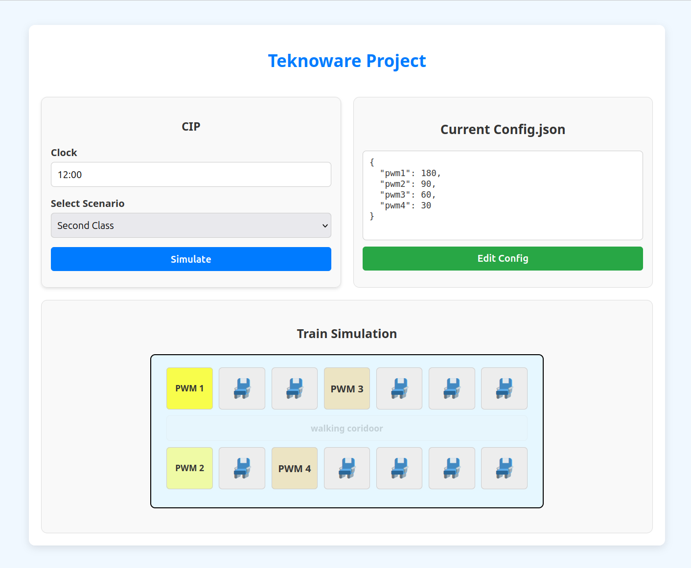

# Train Lighting Simulator

This project is developed as part of the OAMK DIN22SP group for the company **Teknoware** based in **Oulu, Finland**. The project aims to simulate industrial communication protocols (e.g., CIP, TRDP) for controlling lighting systems in trains.



## Purpose

The purpose of this project is to develop a web-based simulator that helps in testing and simulating the lighting control scenarios in trains. It emulates communication between the Central Train Computer (CTC) and Remote Device (RD) through different industrial protocols, allowing operators to control and monitor train lighting systems.

## Features

- **Protocol Simulator**: Simulates communication between the CTC and RD using different protocols (CIP, TRDP).
- **Dynamic UI**: The UI changes based on the protocol selected by the user.
- **Lighting Control**: The system allows users to simulate lighting control commands for different areas (e.g., first-class, second-class).
- **Backend Communication**: The backend processes protocol-specific commands and sends simulated responses to the frontend.

## Author

- **Shovan Das**  
  Third-year IT student at OAMK, Finland  
  Project for **Teknoware**, Oulu, Finland

## Technologies Used

- **Frontend**: React, JavaScript, Bootstrap
- **Backend**: Node.js, Express
- **Protocols**: CIP, TRDP (as examples)

## Raspberry Pi Setup for Remote Device (RD)

The Raspberry Pi will serve as the **Remote Device (RD)** that receives lighting control commands from the Central Train Computer (CTC) and sends responses back.

### **Raspberry Pi Hardware Requirements**
- Raspberry Pi (any model with Ethernet port or Wi-Fi support)
- Ethernet cable or Wi-Fi adapter
- External LED strips (optional) for lighting demonstration
- Power supply for Raspberry Pi

### **Steps for Raspberry Pi Setup**

1. **Install Raspberry Pi OS**
   - Download and install [Raspberry Pi OS](https://www.raspberrypi.org/software/) on an SD card.
   - Insert the SD card into the Raspberry Pi and boot it up.

2. **Connect to Network**
   - Connect the Raspberry Pi to the same network as your **CTC**.

3. **Install Required Software**
   - Install **Node.js** on the Raspberry Pi:
     ```bash
     sudo apt update
     sudo apt install nodejs npm
     ```

4. **Clone Repository on Raspberry Pi**
   - Clone the repository for the backend server:
     ```bash
     git clone <repository-url>
     cd train-lighting-simulator/backend
     ```

5. **Configure Raspberry Pi for RD Role**
   - Modify the **backend server** code to handle protocol-specific messages and simulate responses.
   - Optionally, connect external LED strips to GPIO pins and control them with PWM.

6. **Test Communication**
   - Send protocol messages from the frontend and observe the responses from the Raspberry Pi.

7. **Run the RD Backend Server**
   - Start the backend server to listen for protocol messages:
     ```bash
     npm start
     ```

---

## Setup Instructions

### **Frontend**

1. **Clone the repository**:
   ```bash
   git clone <repository-url>
   cd train-lighting-simulator/frontend
   ```
   
2. **Install dependencies**:
   ```bash
   npm install
   ```

3. **Run the development server**:
   ```bash
   npm start
   ```

4. **Access the application** at `http://localhost:3000`.

### **Backend**

1. **Clone the repository**:
   ```bash
   git clone <repository-url>
   cd train-lighting-simulator/backend
   ```

2. **Install dependencies**:
   ```bash
   npm install
   ```

3. **Run the backend server**:
   ```bash
   npm start
   ```

4. **Access the server** at `http://localhost:5000`.

## License

This project is licensed under the MIT License.
